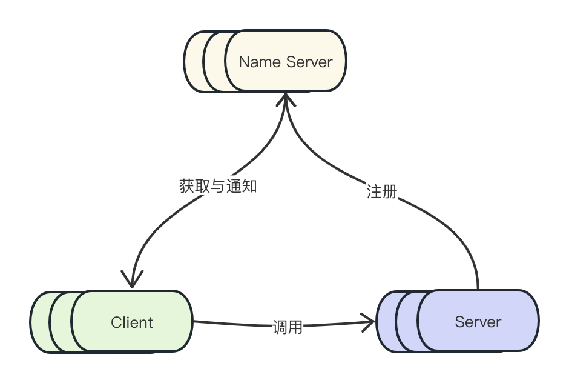

JYrpc 是一款高性能、可拓展的 rpc 框架，非常适合新手学习。它主要包括下面的功能。
## 基础功能
### 网络
JYrpc 支持 bio 和 nio 两种模式的网络。其中 bio 属于学习用，单独打了 tag。nio 是通过 Netty 实现的，后续的功能都是基于 Netty。
<br>
### 协议
JYrpc 实现了自定义协议。协议由协议头和协议体组成。
<br>
```java
public class RpcCommand implements Serializable {
    // Magic Number
    private long magicNumber;
    // RPC 协议版本
    private int protocolVersion;
    // 消息类型，标识这次请求的类型
    private int messageType;
    // 序列化类型
    private int serializeType;
    // 消息唯一 id
    private long messageId;
    // header 长度
    private long headerSize;
    // header 扩展字段
    private byte[] headerExtend;
    // 消息总长度（包括消息头和消息体）
    private long totalSize;
    // 消息体
    private byte[] payload;
}
```
header 和 body 部分都不是定长的，都预留了扩展字段，方便后期的扩展
### 序列化
JYrpc 目前只支持 JSON 和 hessian 两种序列化模式。可以通过实现 Serializer 接口来扩展序列化模式。
### 动态代理
## 高级功能
### 插件式架构
### 服务注册中心

JYrpc 未来会支持多种服务注册中心，包括 Zookeeper、Etcd、Nacos 等。你可以通过配置文件指定使用哪种注册中心，也可以通过 SPI 机制自定义注册中心。
<br>
注册中心会暴露 TCP 连接供客户端和服务端调用，通过自定义的协议沟通。
<br>
Client 和 NameServer 通过 long polling 机制定时拉取关注的服务列表。Name Server 会将 Client 端地址留存到内存中，会定时将数据主动同步到 Client 端。
当有 Server 发生变化时，会通知 Client 端。
<br>
Server 在启动时会向 Name Server 注册，并且定时发送心跳包，保持连接。Name Server 会界定心跳阈值，以此判断 Server 的存活情况。
<br>
### 负载均衡
### 服务路由
### 同步、异步调用
### 超时
### IO 线程与业务线程
